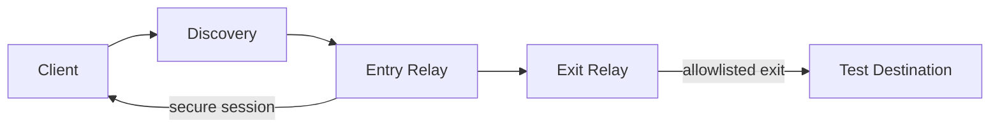

# Real-Layer / Ghost Layer

A Rust-based relay and networking prototype focused on controlled peer discovery, authenticated session establishment, route selection, and bounded application-level forwarding.

This project is intentionally not a public VPN, not an anonymity system, and not an unrestricted Internet access layer. It is a controlled, policy-first network prototype that validates transport behavior, secure routing state, and allowlisted exit handling in a bounded test environment.

## Executive Summary

The repository currently includes:

- a shared `network` crate for identities, transport setup, discovery, session handling, and encrypted channels
- a `relay` crate for metadata, health, routing, multi-hop forwarding, and exit-policy enforcement
- a Rust `client` that connects to configured peers and exercises the relay flow
- Docker and deployment examples for local and VPS-style setup
- integration tests covering discovery, session, multi-hop forwarding, and controlled TCP exit behavior

The core design is intentionally conservative:

- all peers are explicit and configured
- sessions are authenticated and versioned
- route selection is deterministic and metadata-driven
- forwarding is bounded and purpose-specific
- exit destinations are strict allowlists, not wildcard or public access

## Current State

### Done

- libp2p + QUIC transport layer with persistent Ed25519 identities
- peer discovery over request/response protocol and metadata exchange
- relay health, heartbeat, and in-memory registry flow
- secure session establishment using X25519 + HKDF + ChaCha20-Poly1305
- encrypted channel abstraction with sequence validation and replay protection
- one-hop and two-hop route selection logic
- controlled multi-hop forwarding between client, entry relay, and exit relay
- exit packet handling with explicit destination policy and allowlisted TCP exits
- local runtime tests and Docker-based relay examples

### Still left / intentionally deferred

- unrestricted Internet forwarding
- TUN/TAP or OS-level packet routing integration
- public decentralized registry or Solana/MagicBlock coordination as a live network layer
- production reputation, staking, rewards, and DePIN settlement logic
- anonymous traffic obfuscation or privacy guarantees beyond controlled protocol boundaries
- any claim of real-world public deployment without explicit operator-controlled validation

> This is a prototype and a technical control-plane foundation, not a production VPN service.

## System Architecture



### Components

- `client/` – client bootstrap, discovery, route selection, and session initiation
- `network/` – shared networking primitives: config, identities, session crypto, discovery, channels, packet handling
- `relay/` – relay runtime, metadata, health, routing, forwarding manager, exit policy enforcement
- `docker/` – containerized relay deployment examples
- `docs/` – architecture and deployment notes
- `tests/` – integration tests simulating controlled relay behaviors

## Repository Layout

- `client/` – user-side Rust client prototype
- `network/` – shared protocol, identity, session, and transport code
- `relay/` – relay node implementation with health, registry, and forwarding logic
- `docker/` – relay container and Compose examples
- `docs/` – architecture and deployment documentation
- `scripts/` – operational utilities
- `tests/` – integration and multi-hop runtime tests

## Installation and Development

### Prerequisites

- Rust stable (current workspace targets Rust 1.80+)
- a working Cargo toolchain
- optionally Docker for Compose-based local validation

### Build and test

```bash
cargo check
cargo test
```

For a workspace build from the repository root:

```bash
cargo build --workspace
```

## Quick Start

1. Review the configuration environment variables defined in the network config types.
2. Start a relay with a persistent identity file.
3. Set `GHOST_BOOTSTRAP_PEERS` to explicit peer multiaddrs.
4. Run the client with a valid route mode (`one-hop` or `two-hop`).
5. Validate using the controlled test paths described in the relay tests.

## Security and Operational Boundaries

This project intentionally enforces strict boundaries:

- no unfiltered public destination handling
- no default TUN route installation
- no wildcard DNS resolution or implicit fallback
- no anonymous client IP protection claims
- no production on-chain traffic path for user payloads

Any deployment should be treated as a private, operator-controlled network simulation until explicit external validation is completed.

## Documentation Map

- [docs/architecture.md](docs/architecture.md) – design intent and architecture overview
- [docs/deployment.md](docs/deployment.md) – runtime, Docker, identity, and VPS guidance
- [docs/project-status.md](docs/project-status.md) – implementation status, roadmap, and done-vs-left view

## Roadmap

### Near term

- stabilize runtime tests and edge conditions
- improve operational observability and config validation
- document production hardening recommendations

### Medium term

- formalize route policy and health scoring extensions
- add stronger integration tests for multi-hop failure and rejection paths
- further separate operational state from future on-chain coordination layers

### Long term

- controlled on-chain coordination only for metadata and signaling
- optional gateway adapters for specific use-cases under strict policy enforcement
- production-grade deployment tooling when real-world operator requirements are defined

## Important Note

The repository currently demonstrates a real technical foundation for secure relay interaction, not a production-grade privacy network or public Internet gateway. The code and docs are aligned around that boundary.
