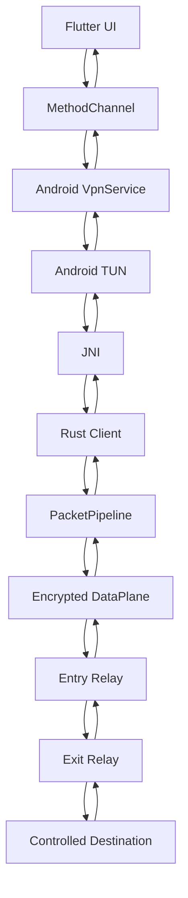
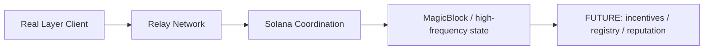

# Real Layer

Formerly Ghost Layer.

Real Layer is a proof-driven networking and relay prototype focused on secure routing, bounded forwarding, Android TUN integration, and controlled client-to-relay communication. The repository currently represents a technical foundation for private routing experiments rather than a public VPN or unrestricted Internet access layer.

## Vision

Real Layer is designed around the following engineering principles:

- authenticated peer and relay communication
- explicit route and exit policy enforcement
- encrypted session establishment and bounded forwarding
- Android VPN integration through a controlled TUN boundary
- future coordination and relay-topology expansion without claiming production anonymity guarantees

## Current honesty boundary

This repository does not claim:

- unrestricted VPN access
- guaranteed anonymous browsing
- public Internet proxy functionality
- production-grade anonymity network operation
- live DePIN or Solana routing behavior without runtime proof

Only features that are implemented and verified in source or runtime are described as active.

## Project status at a glance

| Component | Status |
| --- | --- |
| Flutter UI | Implemented |
| Android VpnService foundation | Implemented |
| MethodChannel bridge | Implemented |
| JNI bridge | Implemented |
| Android TUN foundation | Implemented |
| Rust client | Implemented |
| libp2p / QUIC | Implemented |
| Secure data plane | Implemented |
| Entry / exit relay | Implemented |
| Real packet forwarding | Verification pending |
| Real public IP change | Verification pending |
| Production VPN | Not claimed |
| Solana coordination | Planned / partial |
| MagicBlock integration | Planned / partial |
| DePIN incentives | Planned |

## Architecture overview

## Future decentralized architecture

> Future coordination components are shown as planned work only and are not presented as active production features.

## Repository layout

- `client/` – client-side Rust runtime and bridge integration
- `network/` – shared networking, config, health, packet, session, and transport layers
- `relay/` – relay runtime and forwarding logic
- `real_layer_app/` – Flutter Android app and native bridge layer
- `docs/` – architecture, deployment, and status notes
- `docker/` – deployment and local relay examples
- `scripts/` – utility scripts and operational helpers
- `tests/` – integration and validation paths
- `README.md` – project summary and current engineering posture
- `reallayer.txt` – project identity and repository reference for handoff tracking

## Technologies in active use

The following technologies are present or currently relevant in the codebase and documentation:

- Flutter
- Dart
- Android VpnService
- MethodChannel
- JNI
- Rust
- libp2p
- QUIC
- Ed25519 identities
- secure session establishment
- encrypted data plane
- sequence and replay protection
- route binding
- destination allowlisting
- bounded forwarding
- TCP / UDP forwarding components where they are actually implemented

The following are explicitly treated as future or planned work when they are not yet proven live:

- Solana coordination
- MagicBlock integration
- DePIN or incentive infrastructure
- public relay marketplace or registry behavior

## Security architecture

The project currently emphasizes the following technical controls:

- persistent Ed25519 node identity
- authenticated secure sessions
- key exchange and authenticated encryption
- sequence validation and replay protection
- route/session binding
- deny-by-default exit policy
- explicit destination allowlists
- bounded forwarding and policy-aware exits
- controlled external destination scope

### Current limitations

The repository does not currently claim a production VPN, unrestricted transit layer, or privacy guarantee beyond the controlled protocol and environment boundaries. Any public-facing claim must be backed by fresh runtime verification and real packet proof.

## Implementation status

| Area | Status | Notes |
| --- | --- | --- |
| Flutter UI | Implemented | App shell and debug path are present |
| Android VpnService foundation | Implemented | Service path and permission flow exist |
| MethodChannel integration | Implemented | Mechanism exists for start/stop VpnService calls |
| JNI bridge | Implemented | Native bridge layer is present |
| TUN boundary | Implemented foundation | Ownership and setup work has been addressed |
| Rust relay / client | Implemented | Core network and session logic exist |
| Secure transport | Implemented | Authenticated and encrypted session components are present |
| Real packet forwarding | Verification pending | Requires runtime proof at the Android TUN boundary |
| Public IP change | Verification pending | Not yet proven with a fresh APK run |
| Production VPN claim | Not claimed | Guarded by proof gate |

## Development status

### Completed

- Rust networking foundation
- relay architecture
- Android VPN foundation
- TUN ownership safety work
- JNI bridge
- Flutter UI
- Flutter backend bridge
- Flutter CONNECT callback source fix

### Current blocker

Fresh APK runtime verification has not yet been completed.

The active proof sequence is:

1. Flutter main entry reached
2. CONNECT tap reached
3. backend bridge invoked
4. VPN method begin invoked
5. Android VPN start confirmation received

This proof gate must be established on a fresh build before higher-level VPN or IP-change claims are made.

## Screenshots

Screenshots will be added after the next successful runtime validation cycle on the Android emulator.

## Roadmap

### Near term

- verify the Flutter to Android VPN callback chain on emulator hardware
- confirm the actual VPN method start sequence end-to-end
- validate the Android TUN ingress path with real traffic
- preserve the current debug flow until the proof gate is complete

### Medium term

- stabilize relay and forwarding validation
- improve configuration hardening and operator visibility
- tighten route policy and exit enforcement

### Long term

- expand relay coordination in a controlled, policy-bound manner
- integrate future coordination systems only when they are explicitly validated
- maintain a strict distinction between implemented features and planned capabilities

## Documentation

- [docs/architecture.md](docs/architecture.md)
- [docs/deployment.md](docs/deployment.md)
- [docs/engineering-status.md](docs/engineering-status.md)
- [docs/REAL_LAYER_STATUS.md](docs/REAL_LAYER_STATUS.md)

## Development notes

This repository is intentionally operating in a proof-first workflow. The engineering goal is to validate a narrow boundary and only then broaden the claims about network function. This approach is designed to prevent unsupported VPN, routing, and anonymity claims while preserving the underlying technical work on the path to real runtime validation.

## Architecture Flow

`mermaid
graph TD
  A[Android App / VpnService] -->|TUN 10.8.0.1/24| B[Rust JNI]
  B -->|PacketPipeline| C[DataPlane]
  C -->|QUIC / libp2p| D[Host Relay Node]
  D -->|OneHop Routing| E[Windows TUN Interface]
  E -->|Windows NAT / Routing| F[Real Internet]
  F -->|Return Traffic| E
  E -->|Relay DataPlane| D
  D -->|QUIC| C
  C -->|PacketPipeline| B
  B -->|VpnService| A
`
