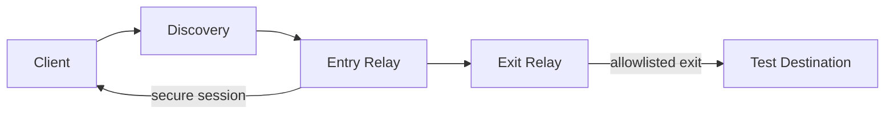

# Real-Layer / Ghost Layer

A Rust-based relay and networking prototype focused on controlled peer discovery, authenticated session establishment, route selection, and bounded application-level forwarding.

This project is intentionally not a public VPN, not an anonymity system, and not an unrestricted Internet access layer. It is a controlled, policy-first network prototype that validates transport behavior, secure routing state, and allowlisted exit handling in a bounded test environment.

## Executive summary

The repository is currently in a strict proof-driven integration phase focused on the Android TUN boundary. The priority is to verify the exact boundary where the VPN tunnel connects to native code before claiming any broader VPN functionality.

### Completed

- Android ARM64 native build was repaired and verified using the correct target-specific linker.
- The app was rebuilt and installed to the connected emulator.
- The Java/Kotlin VPN service successfully created the Android TUN interface and reached the native start boundary.
- The fd ownership bug was resolved by duplicating the TUN descriptor before Rust converted it into a file handle.
- The TUN read loop remains instrumented to log packet ingress at the proof boundary.

### Current proof gate

The project is not allowed to claim VPN behavior until real device traffic is observed traversing the Android TUN interface.

The active requirement is:

1. start the app and grant VPN permission,
2. trigger the CONNECT flow,
3. generate real device traffic,
4. verify actual `VPN_TUN_PACKET_RX` logs with valid packet length and metadata,
5. repeat the flow for three clean cycles before making a functional claim.

### Explicit guardrails

- no UI redesign is in scope,
- no replacement of the existing Rust networking architecture is permitted,
- no claim of relay forwarding or Internet VPN functionality is allowed without real TUN packet proof,
- no synthetic packet injection is allowed for the proof gate,
- the current work remains limited to proving the Android TUN ingress path.

## Workspace

- `client/`: user-side Rust client and native Android bridge
- `relay/`: decentralized Rust relay node
- `network/`: shared peer, configuration, health, and transport abstractions
- `programs/`: future Solana/Anchor coordination modules
- `coordination/`: future MagicBlock coordination components
- `dashboard/`: future UI and operational tooling
- `tests/`: integration and end-to-end test space
- `docs/`: architecture and design documentation
- `docker/`: multi-stage relay image, Compose topology, and systemd example

## Current state

### Done

- libp2p + QUIC transport layer with persistent Ed25519 identities
- peer discovery over request/response protocol and metadata exchange
- relay health, heartbeat, and in-memory registry flow
- secure session establishment using X25519 + HKDF + ChaCha20-Poly1305
- encrypted channel abstraction with sequence validation and replay protection
- one-hop and two-hop route selection logic
- controlled multi-hop forwarding between client, entry relay, and exit relay
- exit packet handling with explicit destination policy and allowlisted TCP exits
- local runtime tests and Docker-based relay examples
- Android TUN startup boundary and fd-ownership fix

### Still left / intentionally deferred

- unrestricted Internet forwarding
- TUN/TAP or OS-level packet routing integration
- public decentralized registry or Solana/MagicBlock coordination as a live network layer
- production reputation, staking, rewards, and DePIN settlement logic
- anonymous traffic obfuscation or privacy guarantees beyond controlled protocol boundaries
- any claim of real-world public deployment without explicit operator-controlled validation
- the required packet proof at the Android TUN ingress boundary

> This is a prototype and a technical control-plane foundation, not a production VPN service.

## System architecture



### Components

- `client/` – client bootstrap, discovery, route selection, and session initiation
- `network/` – shared networking primitives: config, identities, session crypto, discovery, channels, packet handling
- `relay/` – relay runtime, metadata, health, routing, forwarding manager, exit policy enforcement
- `docker/` – containerized relay deployment examples
- `docs/` – architecture and deployment notes
- `tests/` – integration tests simulating controlled relay behaviors

## Repository layout

- `client/` – user-side Rust client prototype
- `network/` – shared protocol, identity, session, and transport code
- `relay/` – relay node implementation with health, registry, and forwarding logic
- `docker/` – relay container and Compose examples
- `docs/` – architecture and deployment documentation
- `scripts/` – operational utilities
- `tests/` – integration and multi-hop runtime tests

## Installation and development

### Prerequisites

- Rust stable (current workspace targets Rust 1.80+)
- a working Cargo toolchain
- optionally Docker for Compose-based local validation

### Build and test

```bash
cargo check
cargo test
```

For a workspace build from the repository root:

```bash
cargo build --workspace
```

## Quick start

1. Review the configuration environment variables defined in the network config types.
2. Start a relay with a persistent identity file.
3. Set `GHOST_BOOTSTRAP_PEERS` to explicit peer multiaddrs.
4. Run the client with a valid route mode (`one-hop` or `two-hop`).
5. Validate using the controlled test paths described in the relay tests.

## Security and operational boundaries

This project intentionally enforces strict boundaries:

- no unfiltered public destination handling
- no default TUN route installation
- no wildcard DNS resolution or implicit fallback
- no anonymous client IP protection claims
- no production on-chain traffic path for user payloads

Any deployment should be treated as a private, operator-controlled network simulation until explicit external validation is completed.

## Documentation map

- [docs/architecture.md](docs/architecture.md) – design intent and architecture overview
- [docs/deployment.md](docs/deployment.md) – runtime, Docker, identity, and VPS guidance
- [docs/engineering-status.md](docs/engineering-status.md) – proof gate and active engineering status

## Roadmap

### Near term

- stabilize runtime tests and edge conditions
- improve operational observability and config validation
- document production hardening recommendations
- complete Android TUN packet proof

### Medium term

- formalize route policy and health scoring extensions
- add stronger integration tests for multi-hop failure and rejection paths
- further separate operational state from future on-chain coordination layers

### Long term

- controlled on-chain coordination only for metadata and signaling
- optional gateway adapters for specific use-cases under strict policy enforcement
- production-grade deployment tooling when real-world operator requirements are defined

## Important note

The repository currently demonstrates a real technical foundation for secure relay interaction, not a production-grade privacy network or public Internet gateway. The code and docs are aligned around that boundary, and the Android TUN packet proof remains the next required milestone before any VPN claim is valid.
